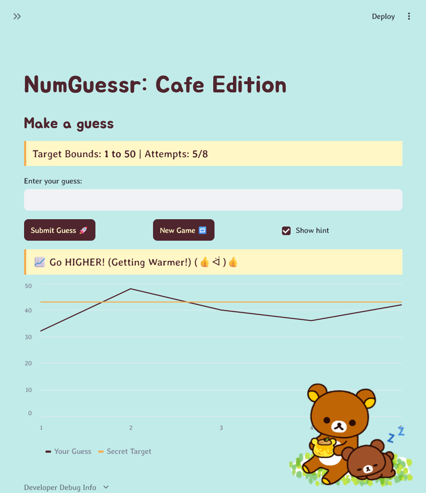

# NumGuessr: Cafe Edition
Forked from *Game Glitch Investigator: The Impossible Guesser*

**The Situation:** Someone asked an AI to build a simple "Number Guessing Game" using Streamlit and I used AI agents to fix her up.

## Setup
1. Install dependencies: `pip install -r requirements.txt`
2. Run the app: `python -m streamlit run app.py`

## Demo Walkthrough
1. User enters a guess of 1 → hint "Too Low"
2. User enters a guess of 50 → hint "Too High"
3. Score updates after each guess
4. Game ends after the correct guess or user exhausts tries
5. User starts a new game with difficulty selection

## Test Results
```
tests\ext_tests.py FFFF                                                [100%]

================================= FAILURES ==================================
__________________ test_negative_number_should_be_invalid ___________________

    def test_negative_number_should_be_invalid():
        """
        EXPECTATION: A negative number is outside any difficulty range (e.g., 1 to 20/50/100).
        The game should recognize this as an invalid guess and reject it during parsing.
    
        NOTE: This test will FAIL on the current code because parse_guess allows '-50'.
        """
        ok, value, err = parse_guess("-50")
    
>       assert ok is False, "Game should reject negative numbers as invalid guesses."
E       AssertionError: Game should reject negative numbers as invalid guesses.
E       assert True is False

tests\ext_tests.py:15: AssertionError
____________________ test_huge_number_should_be_invalid _____________________

    def test_huge_number_should_be_invalid():
        """
        EXPECTATION: An extremely large number is way outside the maximum range (100).
        The game should reject it so the player doesn't waste an attempt or lose points.
    
        NOTE: This test will FAIL on the current code because parse_guess allows '999999'.
        """
        ok, value, err = parse_guess("999999")
    
>       assert ok is False, "Game should reject numbers outside the difficulty upper bound."
E       AssertionError: Game should reject numbers outside the difficulty upper bound.
E       assert True is False

tests\ext_tests.py:28: AssertionError
___________________ test_decimal_input_should_be_rejected ___________________

    def test_decimal_input_should_be_rejected():
        """
        EXPECTATION: This is a whole-number guessing game. If a user inputs a decimal
        like '25.999', the game should tell them to enter a whole number, rather than
        silently slicing off the decimal and guessing '25' without their consent.
    
        NOTE: This test will FAIL on the current code because parse_guess secretly converts floats to ints.
        """
        ok, value, err = parse_guess("25.999")
    
>       assert ok is False, "Game should reject decimal numbers entirely."
E       AssertionError: Game should reject decimal numbers entirely.
E       assert True is False

tests\ext_tests.py:43: AssertionError
________________ test_invalid_guess_does_not_penalize_score _________________

    def test_invalid_guess_does_not_penalize_score():
        """
        EXPECTATION: If a user makes a typo or enters an out-of-bounds number,
        their score should remain untouched because it wasn't a valid strategic guess.
    
        NOTE: This test will FAIL on the current code because passing a negative number
        results in a 'Too Low' outcome, which actively docks 5 points from the score.
        """
        initial_score = 100
    
        # Simulate what happens logded inside app.py using the current utility logic
        ok, value, err = parse_guess("-50")
    
        # If the parser mistakenly lets it through as True, we check if check_guess punishes them
        if ok:
            outcome, message = check_guess(value, secret=25)
            new_score = update_score(current_score=initial_score, outcome=outcome, attempt_number=1)
    
>           assert new_score == initial_score, "Player score should not decrease on an out-of-bounds input."
E           AssertionError: Player score should not decrease on an out-of-bounds input.
E           assert 95 == 100

tests\ext_tests.py:67: AssertionError
========================== short test summary info ==========================
FAILED tests/ext_tests.py::test_negative_number_should_be_invalid - AssertionError: Game should reject negative numbers as invalid guesses.
FAILED tests/ext_tests.py::test_huge_number_should_be_invalid - AssertionError: Game should reject numbers outside the difficulty upper b...
FAILED tests/ext_tests.py::test_decimal_input_should_be_rejected - AssertionError: Game should reject decimal numbers entirely.
FAILED tests/ext_tests.py::test_invalid_guess_does_not_penalize_score - AssertionError: Player score should not decrease on an out-of-bounds input.
============================= 4 failed in 0.24s =============================
```

## 🚀 Stretch Features
Enhanced UI with Gemini; required a couple manual fixes
- recolor everything
- changed fonts
- cut the emojis, added context-appropriate kaomoji (I like the look ^^)
- added corner Rilakkuma

